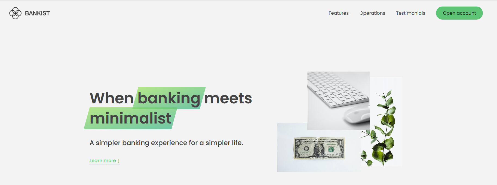

# Bank Web App



## Table of Contents

1. [Introduction](#introduction)
2. [Technologies Used](#technologies-used)
3. [Installation](#installation)

## Introduction

This repository contains the source code for a simple bank web application.

## Technologies Used

- Javascript
- CSS
- HTML

## Installation

1. Clone the repository:

   ```bash
   git clone https://github.com/alexlux58/bank-webapp.git
   ```

2. Open "index.html"
